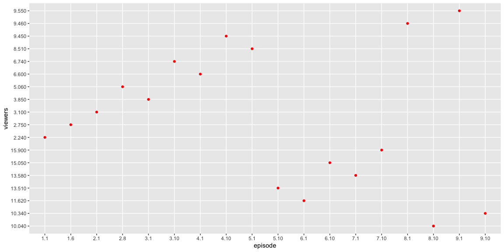
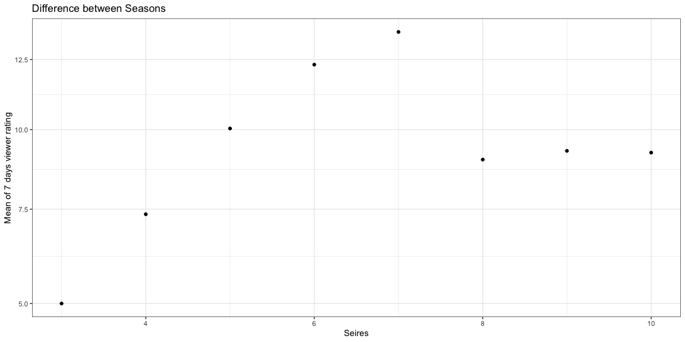

```r
# Use this R-Chunk to import all your datasets!
#View(ratings)
#?ratings
```

## Background

1. Create a graph that illustrates the difference in 7 day ratings between the first and last episode of each season respectively.

2. For seasons with only 10 episodes, create a visualization that displays each episode’s 7-day viewership and also shows the mean rating for each season.

## Data Wrangling


```r
# Use this R-Chunk to clean & wrangle your data!
sevendays <- data.frame(episode = c("1.1", "1.6", "2.1", "2.8", "3.1", "3.10", "4.1", "4.10", "5.1", "5.10", "6.1", "6.10", "7.1", "7.10", "8.1", "8.10", "9.1", "9.10"), viewers = c("2.240", "2.750", "3.100", "5.060", "3.850", "6.740", "6.600", "9.450", "8.510", "13.510", "11.620", "15.050", "13.580", "15.900", "9.460", "10.040", "9.550", "10.340"))
show <- filter(ratings, series != 1 & series != 2)
showmean <- show %>% 
  group_by(series) %>% 
  summarise(mean = mean(viewers_7day))
```

## Data Visualization


```r
# Use this R-Chunk to plot & visualize your data!
ggplot(sevendays, aes(x = episode, y = viewers)) +
  geom_point(color = "red")
```

<!-- -->

```r
meangraph <- ggplot(showmean,aes(x = series,
                   y = mean,
                   )) +
  geom_point() +
  labs(x = "Seires",
       y = "Mean of 7 days viewer rating",
       title = "Difference between Seasons") +
  scale_y_continuous(trans = "sqrt") +
  theme_bw()
meangraph
```

<!-- -->

## Conclusions
The trend of this show is interesting because the rating grows very consistently until it hits season 7-8. It drops a dramatically by season 8 and stays pretty much the same for season 9 and 10. Maybe the series quality went down from season 8 and people just lose their interest of the show.
